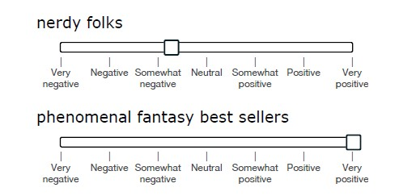
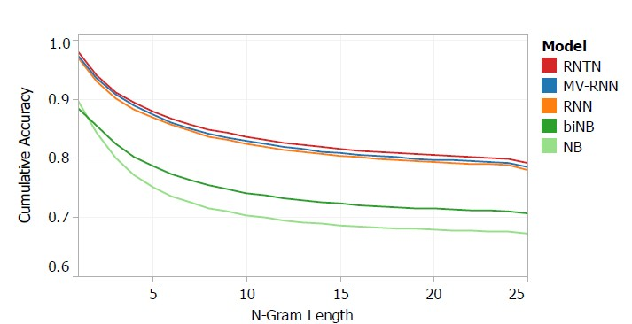

## Review ##

*Recursive Deep Models for Semantic Compositionality Over a Sentiment Treebank*, Richard Socher, Alex Perelygin, Jean Wu, Jason Chuang, Chris Manning, Andrew Ng and Chris Potts. Conference on Empirical Methods in Natural Language Processing (EMNLP 2013, Oral). [pdf](http://nlp.stanford.edu/~socherr/EMNLP2013_RNTN.pdf); [Website with Live Demo and Downloads](http://nlp.stanford.edu/sentiment/)

### Objective/Abstract ###

*Recursive Deep Models for Semantic Compositionality Over a Sentiment Treebank* by Socher et al. introduces Recursive Neural Tensor Network (RNTN), a model for extracting sentiment from longer phrases that outperforms previous models. The model is trained on a corpus of 215,154 phrases that were labelled using Amazon Turk. Using RNTN, single sentence accuracy increases from 80% up to 85.4%; and negation is accurately captured (a task no previous model succeeded at).

### Style ###

The paper is geared toward academic data scientists; originates at Stanford; and contains some formulas that I do not fully comprehend. 

It is accompanied by an accessibly-written [website](http://nlp.stanford.edu/sentiment/) where there is a [live demo](http://nlp.stanford.edu:8080/sentiment/rntnDemo.html), complete training and testing code, and the dataset. The paper has inspired a [competition at kaggle.com](http://www.kaggle.com/c/sentiment-analysis-on-movie-reviews) which challenges the data science community to benchmark their models against the Sentiment Treebank (which is the Amazon Turk labelled corpus derived from a Rotten Tomatoes movie review dataset). As the Kaggle competition announcement states: 
> Obstacles like sentence negation, sarcasm, terseness, language ambiguity, and many others make this task very challenging.

### Method ###

The paper proposes its new model Recursive Neural Tensor Network (RNTN) which
> take as input phrases
of any length. They represent a phrase through word
vectors and a parse tree and then compute vectors for
higher nodes in the tree using the same tensor-based
composition function.

The advantage of RNTN is that 
 
>unlike bag of words models, the RNTN accurately captures the sentiment
change and scope of negation. RNTNs also learn
that sentiment of phrases following the contrastive
conjunction ‘but’ dominates.

Related work, such as semantic vector spaces that use single words, compositionality in vector spaces, logical form and sentiment analysis using 'bag of words' representations, are not capable of recognizing subtle distinctions of sentiment in complex phrases.

The authors feel that 

>ignoring word order in the
treatment of a semantic task is not plausible, and, as
we will show, it cannot accurately classify hard examples
of negation.

#### Dataset ####

In order to evaluate and train compositional models on difficult cases, the authors needed a test dataset and so developed the Sentiment Treebank. It originated with a corpus of movie reviews from [rottentomatoes.com](rottentomatoes.com), parsed them, 

>then used Amazon Mechanical Turk to label the resulting 215,154 phrases

Workers on Amazon Turk manipulated a slider initialized to neutral that had 25 values

The resulting labelled corpus 

>includes fine grained sentiment labels for 215,154 phrases in the parse trees of 11,855 sentences

It offered several insights 

>One of the findings from
labeling sentences based on reader’s perception is
that many of them could be considered neutral. We
also notice that stronger sentiment often builds up
in longer phrases and the majority of the shorter
phrases are neutral. Another observation is that most
annotators moved the slider to one of the five positions:
negative, somewhat negative, neutral, positive
or somewhat positive. The extreme values were
rarely used and the slider was not often left in between
the ticks. Hence, even a 5-class classification
into these categories captures the main variability
of the labels.

Based on these insights the authors developed a notion *fine grained sentiment* classification that needed only 5 demaracations. And set their goal to recover these 5 labels for phrases of all lengths. 

This reduction in the accuracy is in my view one of the weaknesses of the Turk labelling method: underpaid crowd-sourced netizens are not exactly motivated to mull over the subtle distinctions between phrases. The *fine grained sentiment* is actually the inverse: *rough grained sentiment decided on by rushed underpaid net-slaves*.

#### Technically####

In a RNTN,

>each word is represented as a d-dimensional vector...[we]...use the use the word vectors immediately as
parameters to optimize and as feature inputs to
a softmax classifier. For classification into five
classes, we compute the posterior probability

The main difference between RNTN and classic RNN and MV-RNN is that RNTNs
>use the, tensor-based composition function for all nodes.

Apparently this reduces the # of parameters on each node, and minimizes cross-entropy error. 

## Conclusion ##

Many terms are introduced which are well beyond me, -- derivative for the weights of the softmax classifier, Hadamard product, nonconvex optimization using Adagrad, nonlinearity -- so i cannot authoritatively assess it. Regardless, the method seems clean: divide the treebank into train, test,and dev splits. Obviously, these are expert data scientists whose work advances the field. 

In terms of critique, as stated above, I have some doubts about the validity of a reduction in resolution to only 5-label *fine grained sentiment* derived from a low-wage crowd-sourced pool.

And even if the output offered clearly demonstrates a measurable superiority of RNTN compared to other models, its 5% improvement seems only subtly significant when seen visually.

While the claims may be that this is a new method, to my untrained eye, it seems to be a successful optimization modulation of a traditional model (RNN). 

I suspect the ambiguity inherent to language will make radical advances in sentiment analysis difficult, until the intricate implementation problems of deep learning are resolved (as mentioned by the authors) or a really new paradigm (moist quantum computation?) emerges.
